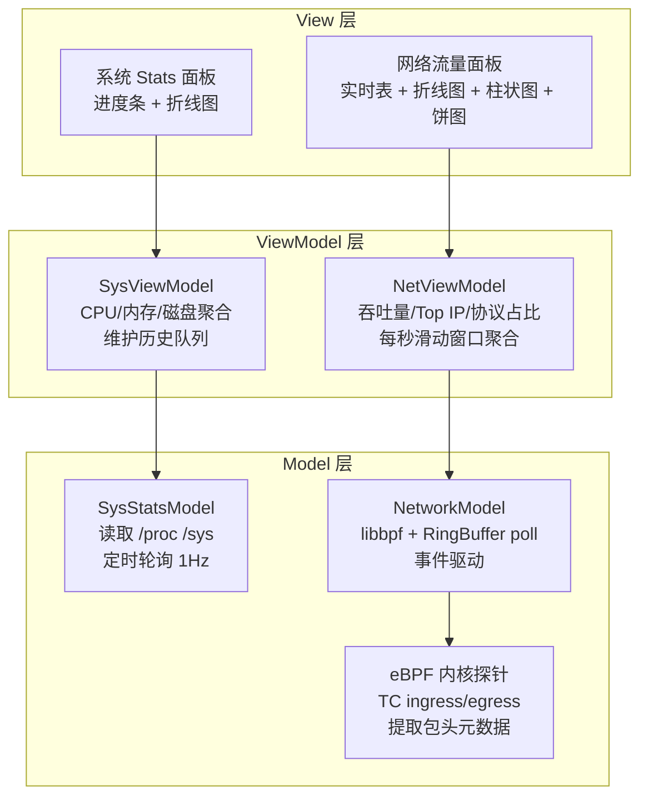
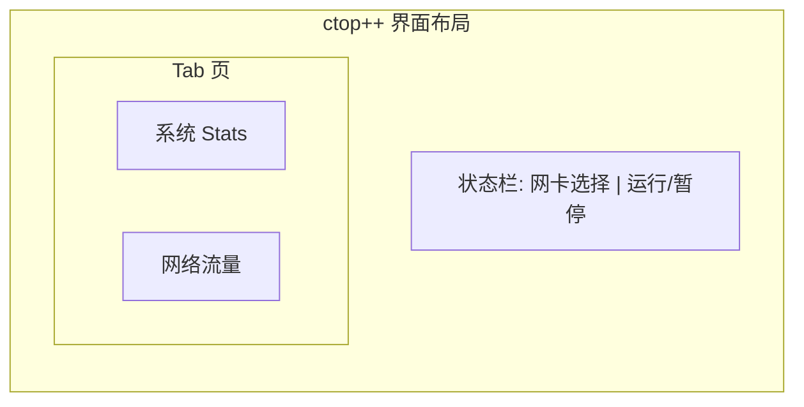

# ctop++ 系统可观测性工具 — 架构设计文档

## 1. 项目定位

ctop++ 是一个基于 **eBPF 与 MVVM 架构** 的 Linux 系统可观测性工具，提供双面板实时监控：

| 面板 | 内容 | 数据源 |
|------|------|--------|
| **系统资源监控 (System Stats)** | CPU 使用率、内存占用、磁盘 I/O | `/proc` + `/sys` 用户态轮询 (1Hz) |
| **网络流量分析 (Network Traffic)** | 包元数据捕获、吞吐量、Top IP、协议占比 | eBPF 内核探针 → RingBuffer → libbpf |

技术栈：C++17 · libbpf · ImGui · ImPlot · CMake · vcpkg

---

## 2. 架构总览

采用 MVVM 三层架构，网络流量与系统资源各自独立的数据管道，在 View 层通过 Tab 页统一展示。



**关键设计决策：**

| 决策 | 选择 | 理由 |
|------|------|------|
| Model 线程模型 | 各自独立线程 | 网络事件驱动（高频）与系统轮询（低频 1Hz）节奏不同，合并会互相阻塞 |
| 数据流向 | Model → ViewModel → View，单向 | ViewModel 持有最新聚合状态，View 只读 |
| 线程安全 | `std::shared_mutex` | ViewModel 被 Model 线程写、被 UI 线程读 |
| 模块耦合 | 接口/回调解耦 | Model 通过 callback 通知 ViewModel，View 通过 getter 读取；依赖倒置 |

---

## 3. Model 层

### 3.1 SysStatsModel — 系统资源采集

通过读取 Linux 标准伪文件系统采集指标，纯用户态实现，无外部依赖。

| 指标 | 文件路径 | 采集方式 |
|------|---------|---------|
| CPU 使用率 | `/proc/stat` | 两次采集差值，计算 idle/user/system 占比（整体 + 每核） |
| 内存 | `/proc/meminfo` | 直接读取 MemTotal / MemAvailable / SwapTotal / SwapFree |
| 磁盘 I/O | `/proc/diskstats` | 两次采集差值，按扇区数换算 KB/s（主要设备：sda/nvme0n1） |
| 网络接口速率 | `/proc/net/dev` | 两次采集差值，每网卡收/发字节数 |

**数据结构：**

```cpp
struct CpuStats {
    float  total_pct;
    std::vector<float> per_core_pct;
};

struct MemStats {
    uint64_t total_kb;
    uint64_t avail_kb;
    uint64_t swap_used_kb;
};

struct DiskStats {
    float read_kbps;
    float write_kbps;
};

struct NetIfStats {
    float rx_kbps;
    float tx_kbps;
};

struct SysStatsSnapshot {
    CpuStats   cpu;
    MemStats   mem;
    DiskStats  disk;
    NetIfStats net_if;  // 系统级网卡流量，区别于 eBPF 包级分析
};
```

**类接口：**

```cpp
class SysStatsModel {
public:
    using Callback = std::function<void(const SysStatsSnapshot&)>;
    void set_callback(Callback cb);
    void start();  // 启动轮询线程，1Hz
    void stop();
};
```

### 3.2 NetworkModel — eBPF 网络流量采集

eBPF 内核探针在 TC 钩子点提取网络包的元数据（不抓 payload），通过 BPF RingBuffer 传递到用户态。

**为什么选 TC 而非 XDP：** XDP 仅能 hook 入站流量（ingress），TC 可同时覆盖 ingress 和 egress，能看到完整的收发流量。

**包元数据结构（内核态 → 用户态）：**

```cpp
struct PacketRecord {
    uint32_t src_ip;
    uint32_t dest_ip;
    uint16_t src_port;
    uint16_t dest_port;
    uint8_t  protocol;       // TCP=6, UDP=17, ICMP=1
    uint32_t length;         // 包长度（字节）
    uint64_t timestamp_ns;   // 内核时间戳
};
```

**类接口：**

```cpp
class NetworkModel {
public:
    bool init(const char* iface);  // 加载 BPF 程序，绑定指定网卡
    using Callback = std::function<void(const PacketRecord&)>;
    void set_callback(Callback cb);
    void start();  // 启动 RingBuffer poll 线程
    void stop();
};
```

**依赖：** libbpf (加载 BPF skeleton)、clang (编译 BPF C 程序为目标代码)

---

## 4. ViewModel 层

ViewModel 负责将 Model 产出的原始数据转化为 View 可直接使用的展示数据，同时维护历史队列供图表渲染。

### 4.1 SysViewModel

```cpp
struct SysViewData {
    // 实时值
    float    cpu_total_pct;
    std::vector<float> cpu_per_core_pct;
    float    mem_used_pct;
    uint64_t mem_total_gb;
    uint64_t mem_avail_gb;
    float    disk_read_mbps;
    float    disk_write_mbps;
    float    net_rx_mbps;
    float    net_tx_mbps;

    // 历史数据（供折线图，最近 60 个采样点）
    std::deque<float> cpu_history;
    std::deque<float> mem_history;
};

class SysViewModel {
public:
    void on_snapshot(const SysStatsSnapshot& snap);  // Model 回调入口
    const SysViewData& get_data() const;              // View 只读访问
};
```

**聚合逻辑：** 每次收到 `SysStatsSnapshot` 后更新 `SysViewData`，CPU 百分比用两次差值除以总时间差计算，历史队列上限 60 点。

### 4.2 NetViewModel

```cpp
struct NetViewData {
    // 吞吐量
    float    download_kbps;
    float    upload_kbps;
    uint64_t packet_count;   // 每秒包数

    // 协议占比
    float tcp_pct;
    float udp_pct;
    float icmp_pct;

    // Top IP 排行
    struct IpRank { std::string ip; uint64_t bytes; };
    std::vector<IpRank> top_talkers;  // Top 10

    // 实时包表
    struct PacketRow {
        std::string time, src, dst, protocol;
        uint32_t length;
    };
    std::deque<PacketRow> recent_packets;  // 最近 1000 条

    // 网速历史
    std::deque<float> download_history;  // 60 点
    std::deque<float> upload_history;
};

class NetViewModel {
public:
    void on_packet(const PacketRecord& pkt);   // 高频事件入口
    void tick();                                // 每秒结算一次
    const NetViewData& get_data() const;
};
```

**核心逻辑 — 每秒滑动窗口：**
- 收到 `PacketRecord` → 累加到当前秒的计数器（`bytes_in` / `bytes_out` / `pkt_count`）
- 检测是否跨秒：跨秒时将上一秒统计结算到 `NetViewData`，重置计数器
- `tick()` 由外部定时器驱动或内部自检

**Top IP 排行：** 维护 `unordered_map<uint32_t, uint64_t>`（IP → 累计字节），每秒用 `partial_sort` 取 Top 10。

**双缓冲策略（可选优化）：** 高频包路径上避免锁竞争，Model 写入 Buffer A，结算时 swap 到 Buffer B，View 读取 Buffer B。

---

## 5. View 层

采用 ImGui + ImPlot 实现，通过 Tab 页切换两个面板，顶部状态栏统一展示网卡选择和运行控制。



### Tab 1：系统资源监控

| 区域 | 组件 | 内容 |
|------|------|------|
| 实时数值 | `ImGui::ProgressBar` | CPU / 内存 / 磁盘使用率，颜色阈值（绿→黄→红） |
| CPU 历史 | ImPlot `LinePlot` | 总 CPU + 可选每核，最近 60 秒 |
| 内存历史 | ImPlot `LinePlot` | 已用/可用面积图，最近 60 秒 |

### Tab 2：网络流量分析

| 区域 | 组件 | 内容 |
|------|------|------|
| 包实时表 | `ImGui::Table` + clipper | 滚动 1000 行：[时间] [源IP→目的IP] [协议] [长度] |
| 网速折线图 | ImPlot `LinePlot` | 双折线：下载/上传，最近 60 秒 |
| Top IP 排行 | ImPlot `BarPlot` | 横向柱状图，Top 10 流量 IP |
| 协议占比 | ImPlot `PieChart` | TCP / UDP / ICMP 比例 |

**开发期数据模拟：** View 层开发不依赖 Model 完成。通过注入假数据生成器（随机 IP、随机包长、正弦波网速）即可独立调校界面流畅度。

---

## 6. 团队分工

| 角色 | 负责模块 | 交付物 |
|------|---------|--------|
| **同学 A** | `SysStatsModel` + `SysViewModel` 实现 | `/proc` 文件读取、CPU/内存/磁盘/网卡数据采集、聚合逻辑实现 |
| **同学 B** | View 层全部 | ImGui 双 Tab 界面、ImPlot 图表、假数据驱动开发 |
| **同学 C** | eBPF 探针 + `NetworkModel` + `NetViewModel` + 工程配置 | BPF C 程序、libbpf 用户态桥接、网络数据聚合、CMake/vcpkg 工程搭建 |

**接口契约：** C 负责定义跨角色的数据结构（`SysStatsSnapshot`、`SysViewData`、`PacketRecord`、`NetViewData`）和相关类的头文件接口，确保三人可独立并行开发。

**开发顺序：**

```
Phase 1: C 定义全部接口 + 搭建 CMake/vcpkg 工程骨架
                ↓
Phase 2:    A 写 SysStats 管线      B 用假数据调界面      C 写 eBPF + 网络管线
                ↓                        ↓                    ↓
Phase 3:                       集成联调
```

---

## 7. 技术栈与依赖

| 组件 | 用途 | 引入方式 |
|------|------|---------|
| libbpf | 加载 BPF 程序、RingBuffer poll | vcpkg |
| ImGui | UI 框架 | vcpkg (docking 分支) |
| ImPlot | 图表扩展（折线、柱状、饼图） | vcpkg |
| clang | 编译 BPF C 程序为 eBPF 字节码 | 系统包管理器 |
| CMake | 构建系统 | 系统包管理器 |
| vcpkg | C++ 依赖管理 | 子模块或全局安装 |

**目标平台：** Linux kernel 5.8+（BPF RingBuffer 支持），glibc 2.31+

---

## 8. 风险与注意事项

1. **权限：** 加载 eBPF 需 `CAP_BPF` 或 root。开发阶段 `sudo` 运行；后续可考虑分离 BPF 加载进程与 UI 进程。
2. **eBPF verifier：** BPF 程序受内核 verifier 严格约束（循环展开、指令上限、禁止某些 helper），需增量测试。
3. **网卡绑定：** NetworkModel 需用户指定监控网卡（如 eth0），启动时检测网卡是否存在。
4. **CPU 开销：** 高流量场景下 eBPF 可能丢包（RingBuffer 溢出），NetViewModel 需暴露丢包计数器。
